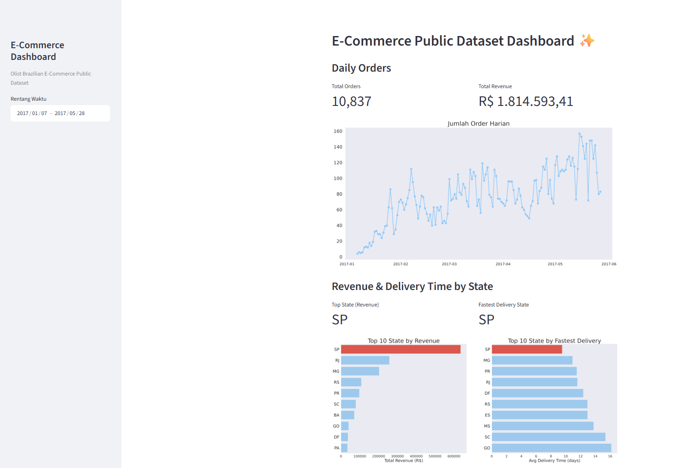
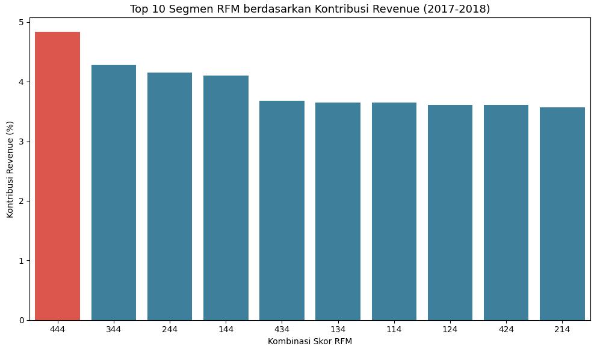
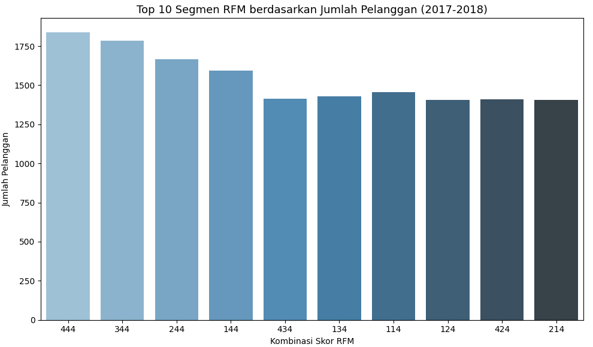
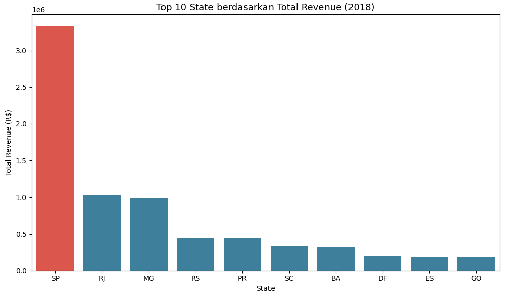
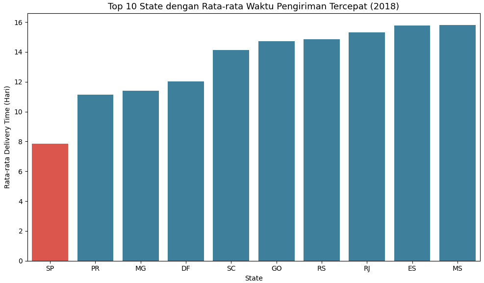

# E-Commerce-Public-Data-Analysis





🔗 **Live Dashboard:** [olist-rfm-dashboard.streamlit.app](https://olist-rfm-dashboard.streamlit.app/)


## Background Problem

Olist is one of the leading e-commerce marketplaces in Brazil, connecting thousands of sellers with customers across 27 states. As the platform grows, two challenges become critical: **knowing which customers are truly valuable** so that marketing budgets are spent efficiently, and **understanding how revenue and delivery performance differ across such a vast country**, where logistics can make or break customer experience.

This project analyzes the Olist E-Commerce Public Dataset (2017–2018) to segment customers using **RFM (Recency, Frequency, Monetary)** analysis and to compare **revenue and average delivery time per state** in 2018. It was built as the final project of the *Fundamental Data Analysis* class on Dicoding, covering the full workflow: Data Gathering, Assessing, Cleaning, Exploratory Data Analysis (EDA), Visualization, and an interactive Streamlit dashboard.

## Business Questions

1. How are customers segmented based on Recency, Frequency, and Monetary (RFM) during 2017–2018, and what percentage of total revenue was contributed by the highest-value customer segment?
   *Focus: high-value customer segmentation to improve marketing budget efficiency.*
2. Which state generated the highest revenue, and what was the average delivery time for each state during 2018?
   *Focus: geographic revenue distribution and delivery logistics efficiency.*

## Tools & Libraries

This project utilizes the following tools for data processing, visualization, and deployment:

* **Python 3.11** – core language for the analysis.
* **Pandas & NumPy** – data wrangling, merging, aggregation, and RFM scoring.
* **Matplotlib & Seaborn** – exploratory visualizations.
* **Jupyter Notebook** – step-by-step documentation of the analysis process.
* **Streamlit** – interactive dashboard, deployed on Streamlit Community Cloud.

## Dataset

The analysis uses four tables from the Olist E-Commerce Public Dataset, joined through `order_id` and `customer_id`:

| Table | Used For |
|---|---|
| `orders` | Main table: order status, purchase and delivery timestamps |
| `customers` | Customer identity (`customer_unique_id`) and `customer_state` |
| `order_payments` | Payment value per order (basis for Monetary and revenue) |
| `order_items` | Order-level item details (assessed during data wrangling) |

## Data Preparation Highlights

* **Delivery time** was calculated only for orders with `delivered` status (about 97% of 99,441 orders), and 8 "delivered" orders with no delivery date were removed as inconsistencies.
* **Payments** were aggregated per `order_id` before merging to prevent duplicated rows (one order can have multiple payment methods).
* **`customer_unique_id`** was used as the customer identity for RFM, since one customer can have several `customer_id` values.
* Date columns were converted to `datetime`, and `customer_zip_code_prefix` was converted to a string to protect leading zeros.
* Price outliers (about 7.5% by IQR) were kept because there was no sign of recording errors.

## Insights

The analysis revealed several important business insights:

* **Revenue is spread across many customer segments:** RFM scoring of **95,770 unique customers** (total revenue **R$15,948,130.86**) produced 64 segments. No single segment dominates the revenue.
* **Segment 444 is the top segment, but only by a small margin:** it contains 1,837 customers (1.92% of all customers) and contributes **4.83%** of total revenue (R$771,018.05). Segments 344 (4.29%), 244 (4.15%), and 144 (4.11%) are close behind.
  
  

* **Frequency is the main differentiator of customer value:** all top 10 segments already have the highest Monetary score, so differences in value come from how often customers buy. Segment 444 has the highest average revenue per customer (about **R$420**), while segment 344 is the lowest of the top 10 (about R$385).

* **São Paulo (SP) leads by a wide margin in 2018:** SP generated **R$3,327,240.09** in revenue, far above Rio de Janeiro (R$1,033,511.02) and Minas Gerais (R$989,191.50).
  

* **SP is also the fastest to deliver:** its average delivery time is **7.85 days**, while Bahia (BA) is the slowest at **18.69 days**. Most states fall within 11–19 days.
  

* **High revenue and fast delivery mostly go together, with exceptions:** 9 of the top 10 revenue states are also in the top 10 fastest delivery states. Rio de Janeiro ranks 2nd in revenue but only 8th in delivery speed (about 15.3 days), while Paraná ranks 5th in revenue but 2nd in delivery speed (11.15 days).

## Advices

Based on the findings, the following steps are recommended:

* Prioritize retention programs for segment 444, such as loyalty tiers, tiered cashback, or early access to new products.
* Increase purchase frequency in high-Monetary segments with lower Frequency (e.g., segment 344) through subscriptions, repurchase reminders, or product bundling.
* Do not focus only on segment 444. Build tiered strategies for segments 444, 344, 244, and 144 since revenue is evenly distributed.
* Use São Paulo as an operational benchmark by reviewing warehouse locations, active sellers, and logistics networks that could be replicated elsewhere.
* Evaluate logistics in Rio de Janeiro to find the cause of slower delivery, since it is the second-largest revenue contributor and delays affect many customers.
* Improve delivery capacity in Bahia through local logistics partners or additional distribution points.
* Study Paraná's logistics practices as a reference for improving delivery speed in other states.

## Directory Structure

```
├── data/               # Raw dataset files (CSV) from the Olist E-Commerce Public Dataset
├── dashboard/
│   ├── dashboard.py    # Main Streamlit dashboard script
│   └── main_data.csv   # Cleaned dataset used for visualization
├── notebook.ipynb      # Step-by-step documentation of the whole analysis
├── requirements.txt    # Python libraries required to run the project
├── url.txt             # Dashboard access URL
└── README.md
```
